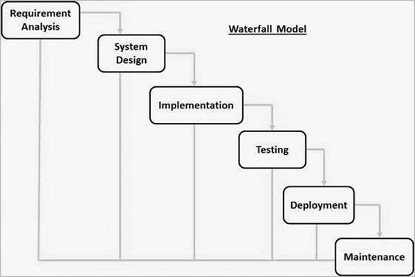
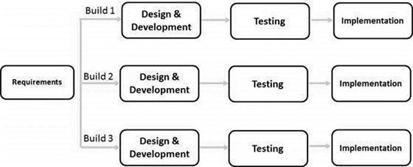
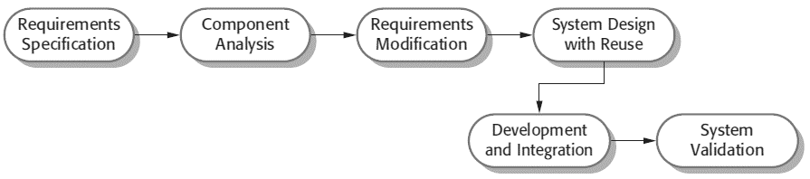

# Plan driven
 All activities are fully and fully planned, taking risks into account, and developing alternative plans in case of emergency.

## Plan driven process

### 1- The waterfall model 

#### Bad: 
Too time consuming - does not accept any change in requirements.

#### Good:
Easy - no team expertise required

### 2- Incremental process model 

#### Good: 
The short time that we can get a tangible product

It can deal with changing requirements, modifying requirements and adding new services

#### Bad: 
Old services can conflict with new services

It is often used to build web applications.

### 3- Reuse-Oriented software engineering

The search here is a stage in which we search for ready-made components that we include in our project, where after performing the analysis process and determining the requirements and services that the system performs, we conduct a search in the market for old systems that serve the services provided by my system, so we collect these ready-made components and link them together to form our system, but Sometimes we have a service that is present in our system, but it is a service that is not in the market and there are no ready-made components that you provide to me. Then we have to perform a process that we self-perform for this service.

#### Good: 
Speed of achievement - reliability due to testing.
#### Bad:
Sometimes the right ingredients are not available - connecting ingredients together can be complicated.

#### --- Reuse with ready-made ingredients:
Example: In web applications we may use ready-made templates for designing interfaces, and therefore web applications develop using this model or incremental model.
#### --- Reuse using knowledge:
That is, the reuse of the idea, not the code.
