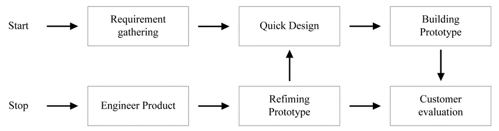
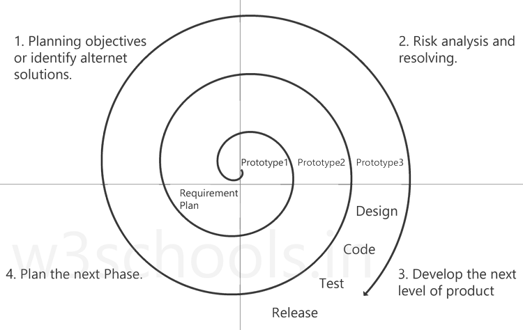

# Plan driven
 All activities are fully and fully planned, taking risks into account, and developing alternative plans in case of emergency.

## Plan driven process

### 1- The waterfall model 

#### Bad: 
Too time consuming - does not accept any change in requirements.

#### Good:
Easy - no team expertise required

### 2- Incremental process model 

#### Good: 
The short time that we can get a tangible product

It can deal with changing requirements, modifying requirements and adding new services

#### Bad: 
Old services can conflict with new services

It is often used to build web applications.

### 3- Reuse-Oriented software engineering

The search here is a stage in which we search for ready-made components that we include in our project, where after performing the analysis process and determining the requirements and services that the system performs, we conduct a search in the market for old systems that serve the services provided by my system, so we collect these ready-made components and link them together to form our system, but Sometimes we have a service that is present in our system, but it is a service that is not in the market and there are no ready-made components that you provide to me. Then we have to perform a process that we self-perform for this service.

#### Good: 
Speed of achievement - reliability due to testing.
#### Bad:
Sometimes the right ingredients are not available - connecting ingredients together can be complicated.

#### --- Reuse with ready-made ingredients:
Example: In web applications we may use ready-made templates for designing interfaces, and therefore web applications develop using this model or incremental model.
#### --- Reuse using knowledge:
That is, the reuse of the idea, not the code.

### 4- Proto-type model

##### This form is used in two situations:
1- Development of a new system with a new idea that has not been implemented before (ambiguous).

2- When the customer is unable to express his requirements.

We design graphics or interfaces for display and output, but these interfaces are ineffective, this leads to motivating the customer to collect requirements from him, because seeing tangible things differs from talking about them anonymously.

##### There are two types of this model:
1- Neglected: it only aims to collect the requirements from the customer, then throw the interfaces and drawings that we have designed and follow up the activities of analysis, design, implementation and testing.

2- Development: the aim is to develop the interfaces that we designed and use in the system that we develop.

#### Good: 
It is the only solution if it is: A completely new system - a customer is unable to express his requirements.

#### Bad:
Time-consuming in the requirement gathering process - effort-consuming - not guaranteed.

 

### 5- Spiral model 

This model consists of four main sectors, namely:
1- Planning

2- Study of Risks 

3- Development

4- Evaluation

#### Good:
It takes into account the changes and studies the risks and is of high quality due to the number of iterations that are implemented to obtain this system and it is maintainable.
#### Bad:
Extremely difficult to implement - it needs a team with experience and high qualifications, and it is applied in large projects such as (the aircraft control system is a very large system and contains a lot of risks).

### The Unified process (RUP)

This procedure performs purpose-oriented analysis and design processes with the help of UML
Unified model language (UML).
The goal of the modeling process:
1- Documentation.

2- Dealing with diagrams is easier than writing.

3- Description: We describe the system in the form of charts, and the plans are drawn up with the requirements document.

4- Understanding the system.

